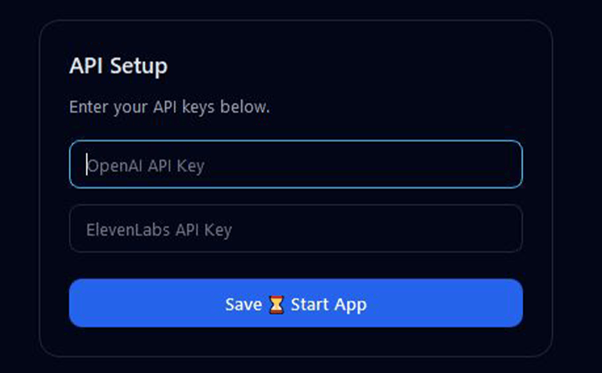

---

## 🚀 T2V-v1 — Text-to-Voice Desktop Application

### *Script Refinement (ChatGPT) → Voice Mapping → Multi-Voice Audio Generation (ElevenLabs)*
---

# 🚀 Overview

**T2V-v1** is a fully standalone **Windows desktop application** that transforms written scripts into final mixed **multi-voice audio** using:

### ✔ GPT-based script refinement

### ✔ Automatic character extraction

### ✔ Voice selection (with Auto-Memory)

### ✔ ElevenLabs text-to-speech

### ✔ Final MP3 (320kbps) + WAV (48kHz PCM) outputs

### ✔ Clean desktop interface

The app is designed for **animation teams, YouTubers, storytellers, and production studios** who want fast, consistent, natural-sounding voiceovers.

---

  

---

# 📜 Usage Terms & Licensing

### This project is intended for personal and individual use only. 
By downloading or using this software/content, you agree to the following:
* **Personal Use**: You are free to use this for your own personal projects and enjoyment.
* **No Redistribution**: You may not re-upload, host, or redistribute these files on other platforms without explicit written permission.
* **Commercial Use**: Any use for profit, business, or commercial enterprise is strictly prohibited without a commercial license.

📧 **Contact**: For commercial licensing inquiries or permission requests, please contact: **GAMESBOND**

---

# 🙌 Credits

Built by **GamesBond**

Powered by **ElevenLabs** + **OpenAI GPT**
