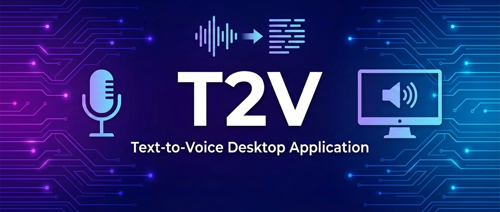
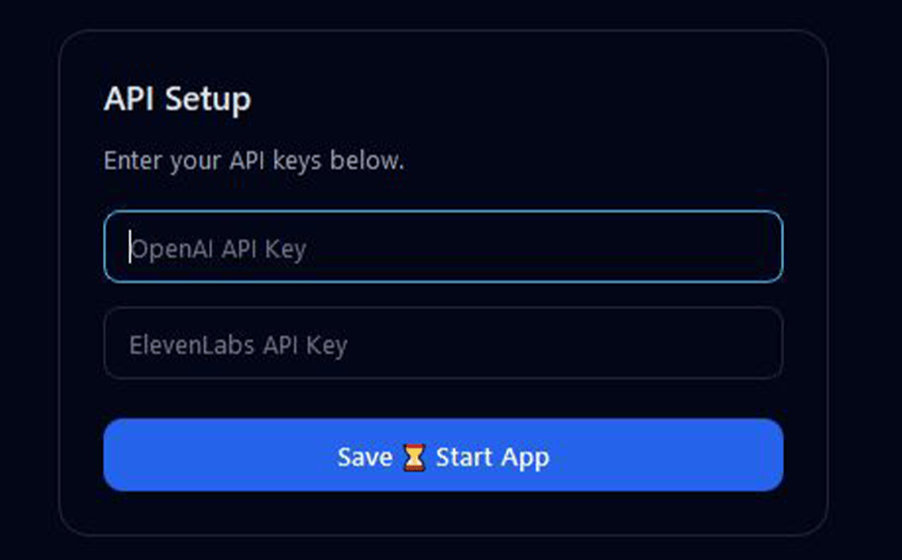

  

  

---

  A standalone Windows desktop application for turning written scripts into natural-sounding <b>multi-voice audio</b> using <b>OpenAI GPT</b> for script refinement and <b>ElevenLabs</b> for voice generation.

  
  
  
  

---

## Overview

**T2V-v1** is a fully standalone **Windows desktop application** that converts scripts into polished, production-ready **multi-voice audio outputs**.

The workflow is built to simplify voice production from start to finish:

- Script refinement using GPT
- Automatic character extraction
- Voice mapping for each character
- Auto-memory for saved voice selections
- Multi-voice text-to-speech generation using ElevenLabs
- Final export in high-quality audio formats

This app is designed for **animation creators, YouTubers, storytellers, voice content producers, and production teams** who want a fast and consistent desktop workflow for voice generation.

---

## Core Workflow

### Script Refinement → Voice Mapping → Multi-Voice Audio Generation

**T2V-v1** helps transform raw written content into final usable voice output through a structured pipeline:

- Refine the script for cleaner dialogue and narration
- Detect and extract characters automatically
- Assign voices to each speaker
- Reuse remembered voice mappings for faster future work
- Generate final mixed voice output
- Export professional-quality MP3 and WAV files

---

## Features

- GPT-based script refinement
- Automatic character extraction
- Voice selection and assignment per character
- Auto-memory for previously selected voices
- ElevenLabs text-to-speech integration
- Final mixed **MP3 (320 kbps)** output
- Final mixed **WAV (48 kHz PCM)** output
- Clean and focused desktop interface
- Standalone Windows workflow

---

## Why Use T2V-v1?

Creating voice content manually can be slow and repetitive, especially when working with multiple characters or dialogue-heavy scripts.

**T2V-v1** is built to make that process faster, cleaner, and more production-friendly.

Ideal for:

- Animation teams
- YouTube content creators
- Storytelling channels
- Dialogue-based projects
- Creative studios
- Voice-driven content production

---

## App Preview

  

---

## Output Formats

The application generates high-quality final outputs suitable for content creation and production workflows:

- **MP3 — 320 kbps**
- **WAV — 48 kHz PCM**

These formats make the app suitable for both quick publishing and higher-quality editing pipelines.

---

## Technology

- Desktop Windows application
- OpenAI GPT for script refinement
- ElevenLabs for text-to-speech generation
- Multi-character voice workflow
- Persistent voice memory system

---

## Use Cases

**T2V-v1** is useful for:

- Animated short videos
- Story narration
- Character dialogue generation
- Voice prototyping
- YouTube storytelling
- Content production pipelines
- Rapid audio draft creation

---

## Usage Terms & Licensing

This project is intended for **personal and individual use only**.

By downloading or using this software/content, you agree to the following:

- **Personal Use:** You may use this for your own personal projects and enjoyment.
- **No Redistribution:** You may not re-upload, host, or redistribute these files on other platforms without explicit written permission.
- **Commercial Use:** Any use for profit, business, or commercial enterprise is strictly prohibited without a commercial license.

**Contact:** For commercial licensing inquiries or permission requests, contact **GAMESBOND**.

---

## Credits

Built by **Jash aka GamesBond**

Powered by **ElevenLabs** and **OpenAI GPT**
